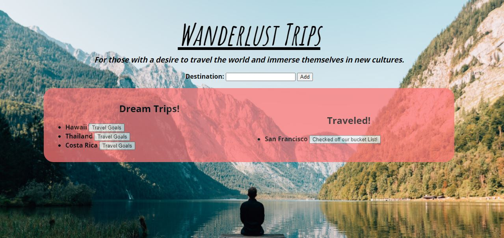

# Wanderlust Trips
Doing Big Tings
### Deployed Application 

### Description 
This application allows users to generate an a list of destinations they would like to travel to.

When using this application, users will be able to add a list of destinations they would like to travel to in the Dream Trips column. Once this destination has been traveled to, the user will click the travel goals button, and the destination will then be moved to the traveled column. 

### Features
* Uses CLI Node.js 
* JavaScript   
* Follows MVC design pattern 
* Utilizes MySQL to query and route 
* Handlebars to generate HTML 
* ORM
* Express.js

### Credit
Alejandra Reyes
* areye022@gmail.com
* [GitHub](https://github.com/areye022)
* [LinkedIn](https://www.linkedin.com/in/alejandrareyes022/)

### License
Licensed under [MIT License](./LICENSE)